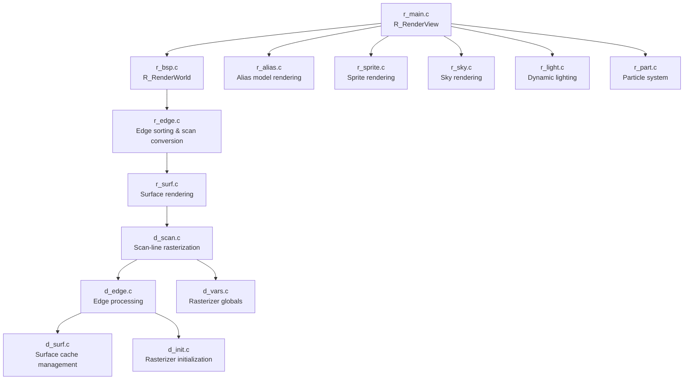
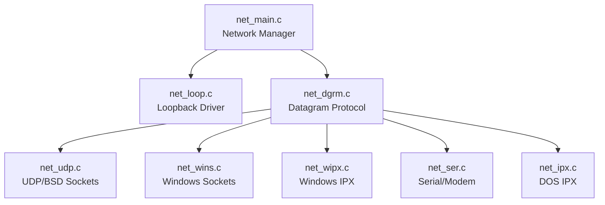
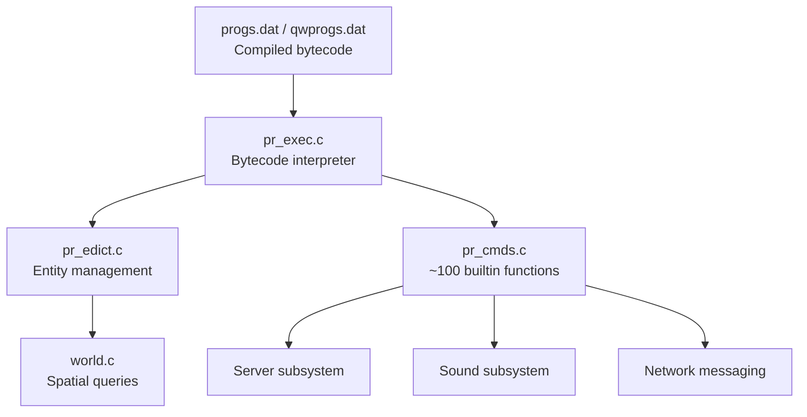
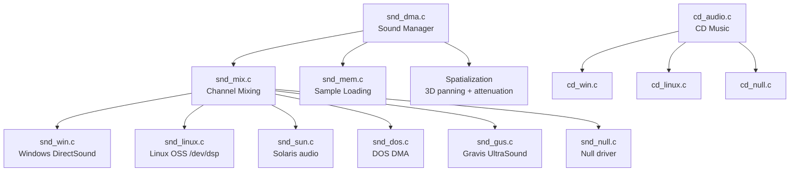

# Component Architecture — Quake Engine

> Reverse-engineered from the id Software Quake source code (1996-1997).
> All file references point to actual source files in this repository.

---

## 1. Rendering Subsystem

### 1.1 Software Renderer

The software renderer implements a **span-based rasterizer** with **edge sorting** for correct visibility.



**Key files and responsibilities:**

| File | Path | Purpose | Key Functions |
|------|------|---------|---------------|
| `r_main.c` | `legacy-src/desktop-engine/` | Rendering entry point, frustum setup | `R_RenderView()`, `R_SetupFrame()` |
| `r_bsp.c` | `legacy-src/desktop-engine/` | BSP tree traversal, visible surface determination | `R_RenderWorld()`, `R_RecursiveWorldNode()` |
| `r_edge.c` | `legacy-src/desktop-engine/` | Edge-based scan conversion | `R_EdgeDrawing()`, `R_ScanEdges()` |
| `r_surf.c` | `legacy-src/desktop-engine/` | Surface rendering with lightmaps | `R_DrawSurface()`, `R_BuildLightMap()` |
| `r_alias.c` | `legacy-src/desktop-engine/` | Animated mesh model rendering | `R_AliasDrawModel()` |
| `r_light.c` | `legacy-src/desktop-engine/` | Dynamic light contribution | `R_AddDynamicLights()`, `R_MarkLights()` |
| `r_part.c` | `legacy-src/desktop-engine/` | Particle effects | `R_DrawParticles()` |
| `r_sky.c` | `legacy-src/desktop-engine/` | Scrolling sky texture | `R_DrawSkyChain()` |
| `d_edge.c` | `legacy-src/desktop-engine/` | Low-level edge processing | `D_DrawSurfaces()` |
| `d_scan.c` | `legacy-src/desktop-engine/` | Affine texture mapping spans | `D_DrawSpans8()` |
| `d_surf.c` | `legacy-src/desktop-engine/` | Surface cache management | `D_CacheSurface()` |

**Key data structures (`legacy-src/desktop-engine/model.h`, `legacy-src/desktop-engine/r_local.h`):**

| Structure | Purpose |
|-----------|---------|
| `mnode_t` | BSP tree node (splitting plane + children) |
| `mleaf_t` | BSP leaf (contains PVS data, surfaces, entities) |
| `msurface_t` | Renderable surface (texture, lightmap, edges) |
| `mplane_t` | Splitting plane (normal vector + distance + type) |
| `surfcache_t` | Cached rendered surface for reuse |

### 1.2 OpenGL Renderer

The OpenGL renderer replaces the software rasterizer with hardware-accelerated polygon rendering.

| File | Path | Purpose | Key Functions |
|------|------|---------|---------------|
| `gl_rmain.c` | `legacy-src/desktop-engine/` | GL rendering entry point | `R_RenderView()`, `R_DrawEntitiesOnList()` |
| `gl_rsurf.c` | `legacy-src/desktop-engine/` | GL surface/BSP rendering | `R_DrawBrushModel()`, `R_DrawWorld()` |
| `gl_mesh.c` | `legacy-src/desktop-engine/` | GL alias model mesh rendering | `GL_MakeAliasModelDisplayLists()` |
| `gl_rlight.c` | `legacy-src/desktop-engine/` | GL dynamic lighting | `R_RenderDlights()` |
| `gl_draw.c` | `legacy-src/desktop-engine/` | GL 2D drawing (HUD, console) | `GL_Upload8()`, `Draw_Pic()` |
| `gl_warp.c` | `legacy-src/desktop-engine/` | GL sky and water warping | `EmitWaterPolys()`, `R_DrawSkyChain()` |
| `gl_model.c` | `legacy-src/desktop-engine/` | GL-specific model loading | `Mod_LoadBrushModel()` |
| `gl_refrag.c` | `legacy-src/desktop-engine/` | GL entity fragment linking | `R_StoreEfrags()` |
| `gl_screen.c` | `legacy-src/desktop-engine/` | GL screen management | `SCR_UpdateScreen()` |
| `gl_vidnt.c` | `legacy-src/desktop-engine/` | GL Windows video driver | `VID_Init()` |
| `gl_vidlinux.c` | `legacy-src/desktop-engine/` | GL Linux SVGA video driver | `VID_Init()` |
| `gl_vidlinuxglx.c` | `legacy-src/desktop-engine/` | GL Linux X11/GLX video driver | `VID_Init()` |

**Defined by:** `GLQUAKE` preprocessor macro

---

## 2. Networking Subsystem

### 2.1 WinQuake Networking



| File | Path | Purpose |
|------|------|---------|
| `net_main.c` | `legacy-src/desktop-engine/` | Network initialization, message dispatch, driver management |
| `net_dgrm.c` | `legacy-src/desktop-engine/` | Reliable datagram protocol (sequence numbers, ACK/retransmit) |
| `net_loop.c` | `legacy-src/desktop-engine/` | Loopback driver for single-machine play |
| `net_udp.c` | `legacy-src/desktop-engine/` | BSD UDP socket implementation |
| `net_wins.c` | `legacy-src/desktop-engine/` | Windows Winsock UDP |
| `net_wipx.c` | `legacy-src/desktop-engine/` | Windows IPX/SPX protocol |
| `net_ser.c` | `legacy-src/desktop-engine/` | Serial/modem point-to-point |

**Key data structure — `qsocket_t` (`legacy-src/desktop-engine/net.h`):**
- Connection state: `connecttime`, `lastMessageTime`, `disconnected`
- Reliable messaging: `ackSequence`, `sendSequence`, `sendMessage[]`
- Receive tracking: `receiveSequence`, `receiveMessage[]`

### 2.2 QuakeWorld Networking

QuakeWorld replaces the WinQuake networking with an internet-optimized system:

| File | Path | Purpose |
|------|------|---------|
| `net_chan.c` | `legacy-src/QW/client/` | Network channel with reliable + unreliable streams |
| `cl_ents.c` | `legacy-src/QW/client/` | Entity delta decompression |
| `cl_pred.c` | `legacy-src/QW/client/` | Client-side movement prediction |
| `sv_ents.c` | `legacy-src/QW/server/` | Entity delta compression for server |
| `sv_send.c` | `legacy-src/QW/server/` | Server message sending, PVS culling |
| `sv_nchan.c` | `legacy-src/QW/server/` | Server reliable channel management |

**Delta compression protocol (`legacy-src/QW/client/protocol.h`):**

| Flag | Bit | Field |
|------|-----|-------|
| `U_ORIGIN1` | `1<<9` | X origin (1/8 unit precision) |
| `U_ORIGIN2` | `1<<10` | Y origin |
| `U_ORIGIN3` | `1<<11` | Z origin |
| `U_ANGLE2` | `1<<12` | Pitch angle (byte) |
| `U_FRAME` | `1<<13` | Animation frame |
| `U_REMOVE` | `1<<14` | Entity removed |
| `U_MOREBITS` | `1<<15` | Extended flags follow |

---

## 3. QuakeC Virtual Machine



| File | Path | Purpose | Key Functions |
|------|------|---------|---------------|
| `pr_exec.c` | `legacy-src/desktop-engine/` | Bytecode execution loop | `PR_ExecuteProgram()`, `PR_EnterFunction()` |
| `pr_edict.c` | `legacy-src/desktop-engine/` | Entity allocation, field access, progs loading | `ED_Alloc()`, `ED_Free()`, `PR_LoadProgs()` |
| `pr_cmds.c` | `legacy-src/desktop-engine/` | Engine-to-script bridge (builtins) | `PF_traceline()`, `PF_sound()`, `PF_spawn()` |
| `pr_comp.h` | `legacy-src/desktop-engine/` | Opcode definitions, instruction format | ~80 opcodes defined |
| `progs.h` | `legacy-src/desktop-engine/` | VM data structures | `edict_t`, `dstatement_t`, `dfunction_t` |

**Instruction format (`legacy-src/desktop-engine/pr_comp.h`):**
```
typedef struct {
    unsigned short op;      // Opcode
    unsigned short a, b, c; // Operand indices into globals
} dstatement_t;
```

**Opcode categories:**
- Arithmetic: `OP_MUL_F`, `OP_DIV_F`, `OP_ADD_F`, `OP_SUB_F`, `OP_ADD_V`, `OP_SUB_V`
- Comparison: `OP_EQ_F`, `OP_NE_F`, `OP_LE`, `OP_GE`, `OP_LT`, `OP_GT`
- Load/Store: `OP_LOAD_F`, `OP_STORE_F`, `OP_STOREP_F`
- Control flow: `OP_IF`, `OP_IFNOT`, `OP_GOTO`, `OP_CALL0`–`OP_CALL8`, `OP_RETURN`, `OP_DONE`

---

## 4. Sound Subsystem



| File | Path | Purpose |
|------|------|---------|
| `snd_dma.c` | `legacy-src/desktop-engine/` | Main sound system: channel management, spatialization, DMA control |
| `snd_mix.c` | `legacy-src/desktop-engine/` | Audio mixing of multiple channels into DMA buffer |
| `snd_mem.c` | `legacy-src/desktop-engine/` | WAV file loading and sample memory management |
| `sound.h` | `legacy-src/desktop-engine/` | Sound structures: `channel_t`, `sfx_t`, `dma_t` |

**Key data structures (`legacy-src/desktop-engine/sound.h`):**

| Structure | Purpose |
|-----------|---------|
| `dma_t` | DMA buffer descriptor (channels, sample rate, bit depth, buffer pointer) |
| `channel_t` | Playing sound channel (position, volume, attenuation, entity) |
| `sfx_t` | Sound effect handle (name, cache pointer) |
| `sfxcache_t` | Cached sound sample data |

---

## 5. Input Subsystem

| File | Path | Purpose |
|------|------|---------|
| `in_win.c` | `legacy-src/desktop-engine/` | Windows input: mouse (DirectInput), joystick (6-axis), keyboard |
| `in_dos.c` | `legacy-src/desktop-engine/` | DOS input: mouse, keyboard via interrupts |
| `in_sun.c` | `legacy-src/desktop-engine/` | Solaris input via X11 events |
| `in_null.c` | `legacy-src/desktop-engine/` | Null input driver (stub) |
| `keys.c` | `legacy-src/desktop-engine/` | Key binding management, key event dispatch |
| `keys.h` | `legacy-src/desktop-engine/` | Key code definitions |
| `input.h` | `legacy-src/desktop-engine/` | Input interface: `IN_Init()`, `IN_Move()`, `IN_Commands()` |

**User command structure (`legacy-src/desktop-engine/protocol.h`):**
```
typedef struct {
    byte    msec;           // Milliseconds since last command
    byte    buttons;        // Button bitmask
    short   forwardmove;    // -127 to 127
    short   sidemove;       // -127 to 127
    short   upmove;         // -127 to 127
    vec3_t  angles;         // Viewing angles
} usercmd_t;
```

---

## 6. Console & Command Subsystem

| File | Path | Purpose |
|------|------|---------|
| `cmd.c` | `legacy-src/desktop-engine/` | Command buffer, tokenization, execution |
| `cmd.h` | `legacy-src/desktop-engine/` | Command interface |
| `cvar.c` | `legacy-src/desktop-engine/` | Console variable registration, get/set |
| `cvar.h` | `legacy-src/desktop-engine/` | CVar structure definition |
| `console.c` | `legacy-src/desktop-engine/` | Console rendering, scrollback, notification |
| `console.h` | `legacy-src/desktop-engine/` | Console interface |

**Command execution pipeline:**
```
Cbuf_AddText("command args\n")     → Queue in command buffer
    ↓
Cbuf_Execute()                      → Process buffer each frame
    ↓
Cmd_TokenizeString("command args")  → Parse into argc/argv
    ↓
Cmd_ExecuteString("command")        → Look up and execute
    ↓
xcommand_t callback()               → Registered function runs
```

**CVar structure (`legacy-src/desktop-engine/cvar.h`):**
```
typedef struct cvar_s {
    char     *name;      // Variable name
    char     *string;    // String value
    qboolean  archive;   // Save to config.cfg
    qboolean  server;    // Send to clients
    float     value;     // Numeric value (auto-parsed)
    struct cvar_s *next; // Linked list pointer
} cvar_t;
```

---

## 7. Platform Abstraction Layer

| File | Path | Platform |
|------|------|----------|
| `sys_win.c` | `legacy-src/desktop-engine/` | Windows (Win32 API, console allocation, timer) |
| `sys_linux.c` | `legacy-src/desktop-engine/` | Linux (signal handling, `/dev/` access) |
| `sys_dos.c` | `legacy-src/desktop-engine/` | MS-DOS (real-mode, DPMI, interrupt handlers) |
| `sys_sun.c` | `legacy-src/desktop-engine/` | Solaris/SunOS |
| `sys_null.c` | `legacy-src/desktop-engine/` | Null platform (stub for porting reference) |
| `sys.h` | `legacy-src/desktop-engine/` | Platform interface definition |

**Interface contract (`legacy-src/desktop-engine/sys.h`):**

| Function | Purpose |
|----------|---------|
| `Sys_FileOpenRead()` / `Sys_FileOpenWrite()` | File I/O |
| `Sys_FileRead()` / `Sys_FileWrite()` | File read/write |
| `Sys_FloatTime()` | High-resolution timer |
| `Sys_Error()` | Fatal error handler |
| `Sys_Printf()` | Console output |
| `Sys_Quit()` | Clean shutdown |
| `Sys_SendKeyEvents()` | Pump platform input events |
| `Sys_ConsoleInput()` | Read from stdin (dedicated server) |
| `Sys_MakeCodeWriteable()` | Make memory executable (for self-modifying ASM) |

---

## 8. Model/BSP Loading Subsystem

| File | Path | Purpose |
|------|------|---------|
| `model.c` | `legacy-src/desktop-engine/` | Model loading, caching, BSP/alias/sprite format parsing |
| `model.h` | `legacy-src/desktop-engine/` | Model data structures |
| `gl_model.c` | `legacy-src/desktop-engine/` | OpenGL-specific model loading (texture upload) |
| `gl_model.h` | `legacy-src/desktop-engine/` | GL model structures |
| `bspfile.h` | `legacy-src/desktop-engine/` | BSP file format definition (version 29, 15 lumps) |

**BSP lumps (`legacy-src/desktop-engine/bspfile.h`):**

| Lump | Content |
|------|---------|
| `LUMP_ENTITIES` | Entity definition strings |
| `LUMP_PLANES` | Splitting planes |
| `LUMP_TEXTURES` | Texture data (mip-mapped) |
| `LUMP_VERTEXES` | Vertex coordinates |
| `LUMP_VISIBILITY` | PVS (Potentially Visible Set) data |
| `LUMP_NODES` | BSP tree nodes |
| `LUMP_TEXINFO` | Texture alignment info |
| `LUMP_FACES` | Surface polygons |
| `LUMP_LIGHTING` | Lightmap data |
| `LUMP_CLIPNODES` | Collision hull nodes |
| `LUMP_LEAFS` | BSP tree leaves |
| `LUMP_MARKSURFACES` | Leaf-to-surface mapping |
| `LUMP_EDGES` | Edge definitions |
| `LUMP_SURFEDGES` | Surface-to-edge mapping |
| `LUMP_MODELS` | Brush model list |

**Model types supported:**

| Type | Format | Magic | Usage |
|------|--------|-------|-------|
| Brush | BSP v29 | — | World geometry, doors, platforms |
| Alias | MDL v6 | `IDPO` | Players, monsters, items |
| Sprite | SPR v1 | `IDSP` | Particles, effects, UI elements |

---

## 9. Video Subsystem

| File | Path | Platform | API |
|------|------|----------|-----|
| `vid_win.c` | `legacy-src/desktop-engine/` | Windows | DirectDraw, DIB, MGL (Scitech) |
| `vid_dos.c` | `legacy-src/desktop-engine/` | DOS | VGA registers, VESA BIOS |
| `vid_svgalib.c` | `legacy-src/desktop-engine/` | Linux | SVGAlib |
| `vid_x.c` | `legacy-src/desktop-engine/` | Linux/Unix | X11 (XImage/XShmImage) |
| `vid_sunx.c` | `legacy-src/desktop-engine/` | Solaris | X11 |
| `vid_sunxil.c` | `legacy-src/desktop-engine/` | Solaris | XIL (accelerated) |
| `vid_null.c` | `legacy-src/desktop-engine/` | Any | Null driver (stub) |
| `vid.h` | `legacy-src/desktop-engine/` | — | Video interface definition |

**Video state (`viddef_t` in `legacy-src/desktop-engine/vid.h`):**

| Field | Purpose |
|-------|---------|
| `buffer` | Framebuffer pixel pointer |
| `colormap` | 8-bit color palette lookup |
| `rowbytes` | Bytes per scanline (pitch) |
| `width`, `height` | Current resolution |
| `aspect` | Pixel aspect ratio |
| `numpages` | Page-flip count (double/triple buffering) |

---

## 10. QuakeWorld-Specific Components

### 10.1 QW Forwarding Proxy

| File | Path | Purpose |
|------|------|---------|
| `qwfwd.c` | `legacy-src/QW/qwfwd/` | UDP relay proxy: forwards packets between clients and servers |
| `misc.c` | `legacy-src/QW/qwfwd/` | Utility functions for the proxy |

Architecture: Maintains a linked list of `peer_t` structures, each mapping a client address to a server connection. Uses `select()` for non-blocking I/O.

### 10.2 Gas2Masm Converter

| File | Path | Purpose |
|------|------|---------|
| `gas2masm.c` | `legacy-src/QW/gas2masm/` | Converts GNU as (AT&T syntax) x86 assembly to MASM (Intel syntax) |

Translates 100+ instruction mnemonics, register names, addressing modes, and section directives.

### 10.3 QuakeC Game Logic

| File | Path | Purpose |
|------|------|---------|
| `defs.qc` | `legacy-src/qw-qc/` | Global definitions, entity fields, builtin function declarations |
| `weapons.qc` | `legacy-src/qw-qc/` | 7 weapon implementations with projectile physics |
| `items.qc` | `legacy-src/qw-qc/` | Health, armor, ammo, keys, powerup pickups |
| `combat.qc` | `legacy-src/qw-qc/` | Damage system (`T_Damage`, `T_RadiusDamage`) |
| `client.qc` | `legacy-src/qw-qc/` | Player spawning, death, respawn, level transitions |
| `spectate.qc` | `legacy-src/qw-qc/` | Spectator mode (non-interactive observation) |
| `doors.qc` | `legacy-src/qw-qc/` | Door mechanics (linked, keyed, secret) |
| `triggers.qc` | `legacy-src/qw-qc/` | Trigger entities (teleport, hurt, push, relay, counter) |
| `plats.qc` | `legacy-src/qw-qc/` | Moving platforms and trains |
| `world.qc` | `legacy-src/qw-qc/` | World initialization and asset precaching |
| `player.qc` | `legacy-src/qw-qc/` | Player animation frame definitions |
| `buttons.qc` | `legacy-src/qw-qc/` | Pushbutton mechanics |
| `misc.qc` | `legacy-src/qw-qc/` | Lights, fireballs, explosive barrels |
| `subs.qc` | `legacy-src/qw-qc/` | Movement utilities and target-firing system |
| `server.qc` | `legacy-src/qw-qc/` | Monster waypoint pathing (path_corner) |
| `models.qc` | `legacy-src/qw-qc/` | Model entity spawning helpers |
| `sprites.qc` | `legacy-src/qw-qc/` | Sprite entity spawning |
