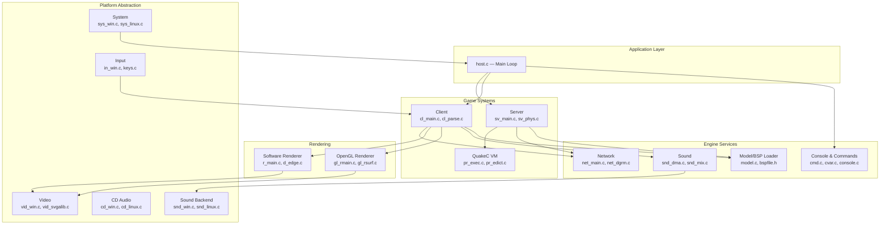
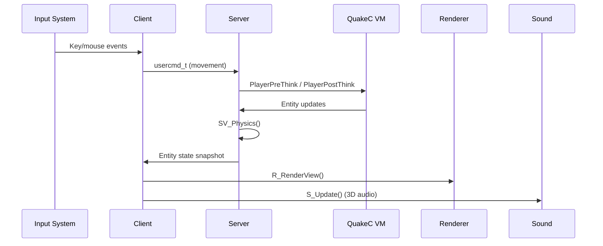
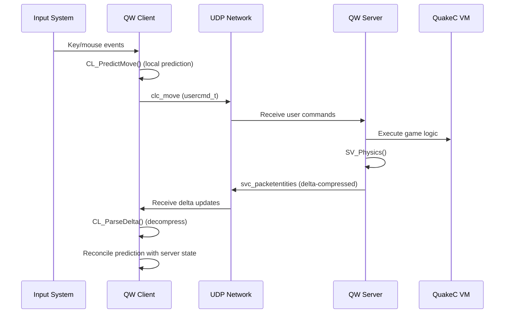
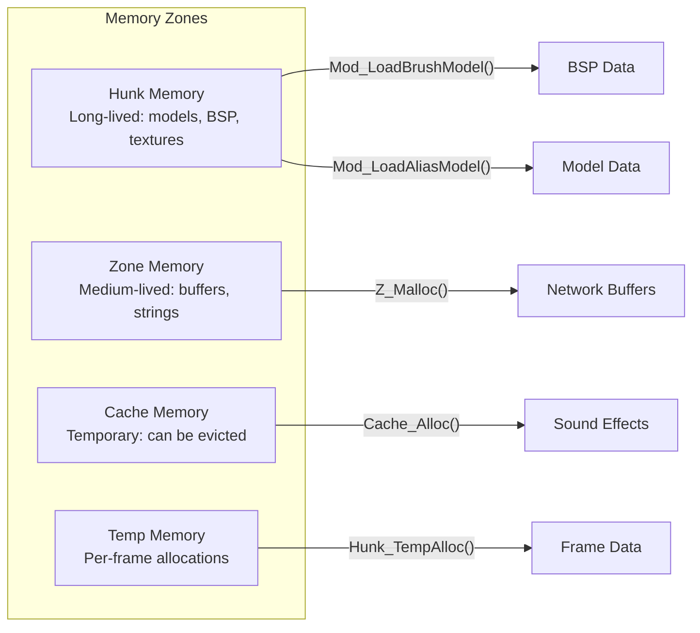

# Architecture Overview — Quake Engine

> Reverse-engineered from the id Software Quake source code (1996-1997).
> All references point to actual source files in this repository.

---

## 1. High-Level Architecture

The Quake engine follows a **single-threaded, frame-based simulation** architecture with a clear separation between the platform abstraction layer and the engine core.



---

## 2. Component Overview

### 2.1 Main Loop (`Quake/WinQuake/host.c`)

The engine runs a single-threaded main loop via `Host_Frame()` (line ~729):

```
Host_Frame()
├── Sys_SendKeyEvents()        — Pump OS input events
├── Cbuf_Execute()             — Execute queued commands
├── Host_ServerFrame()         — Update server (if hosting)
│   ├── SV_Physics()           — Run physics for all entities
│   └── SV_SendClientMessages()— Send state to clients
├── Host_ClientFrame()         — Update client (if connected)
│   ├── CL_ReadPackets()       — Parse server messages
│   ├── CL_SendCmd()           — Send movement to server
│   └── CL_SetUpPlayerPrediction() — Predict local player
├── SCR_UpdateScreen()         — Render frame
│   └── R_RenderView()         — 3D scene rendering
└── S_Update()                 — Update audio spatialization
```

### 2.2 Two Engine Variants

| Variant | Path | Purpose |
|---------|------|---------|
| **WinQuake** | `Quake/WinQuake/` | Full engine for single-player + LAN multiplayer |
| **QuakeWorld** | `Quake/QW/client/` + `Quake/QW/server/` | Internet-optimized multiplayer with separated client & dedicated server |

Key architectural differences:

| Feature | WinQuake | QuakeWorld |
|---------|----------|------------|
| Networking | Reliable datagram, full entity state | Delta compression, unreliable streams |
| Prediction | None (server-authoritative only) | Client-side prediction (`cl_pred.c`) |
| Server | Integrated with client | Dedicated server binary (`qwsv`) |
| Spectators | Not supported | Full spectator mode |
| Protocol | Simple entity updates | Flag-based delta encoding |

---

## 3. Data Flow

### 3.1 Single-Player Data Flow (WinQuake)



### 3.2 QuakeWorld Multiplayer Data Flow



---

## 4. Memory Architecture

The engine uses a custom memory management system (`Quake/WinQuake/zone.c`):



| Zone | Lifetime | Usage | Source |
|------|----------|-------|--------|
| **Hunk** | Level lifetime | BSP data, models, textures | `Quake/WinQuake/zone.c` |
| **Zone** | Variable | Network buffers, command strings | `Quake/WinQuake/zone.c` |
| **Cache** | Evictable | Sound samples, model skins | `Quake/WinQuake/zone.c` |
| **Temp** | Per-frame | Temporary calculations | `Quake/WinQuake/zone.c` |

---

## 5. Build Targets

### WinQuake Targets

| Target | Platform | Renderer | Build File |
|--------|----------|----------|------------|
| `squake` | Linux (SVGAlib) | Software | `Quake/WinQuake/Makefile.linuxi386` |
| `glquake` | Linux (Mesa) | OpenGL | `Quake/WinQuake/Makefile.linuxi386` |
| `glquake.glx` | Linux (X11 GLX) | OpenGL | `Quake/WinQuake/Makefile.linuxi386` |
| `quake.x11` | Linux (X11) | Software | `Quake/WinQuake/Makefile.linuxi386` |
| `WinQuake.exe` | Windows | Software + GL | `Quake/WinQuake/WinQuake.dsp` |
| `quake.sw` | Solaris (X11) | Software | `Quake/WinQuake/Makefile.Solaris` |

### QuakeWorld Targets

| Target | Platform | Description | Build File |
|--------|----------|-------------|------------|
| `qwsv` | Linux/Solaris | Dedicated server | `Quake/QW/Makefile.Linux` |
| `qwcl` | Linux (SVGAlib) | Software client | `Quake/QW/Makefile.Linux` |
| `qwcl.x11` | Linux (X11) | Software client | `Quake/QW/Makefile.Linux` |
| `glqwcl` | Linux (Mesa) | OpenGL client | `Quake/QW/Makefile.Linux` |
| `glqwcl.glx` | Linux (X11 GLX) | OpenGL client | `Quake/QW/Makefile.Linux` |

### Utility Targets

| Target | Description | Build File |
|--------|-------------|------------|
| `gas2masm` | GAS → MASM assembly converter | `Quake/QW/gas2masm/gas2masm.dsp` |
| `qwfwd` | QuakeWorld UDP forwarding proxy | `Quake/QW/qwfwd/` |
| `qwprogs.dat` | Compiled QuakeC game logic | `Quake/qw-qc/progs.src` |

---

## 6. Key Architectural Decisions

| Decision | Rationale | Trade-off |
|----------|-----------|-----------|
| **Single-threaded** | Deterministic behavior, simpler debugging | Cannot leverage multiple CPU cores |
| **BSP tree rendering** | Efficient visibility determination for indoor scenes | Poor for large outdoor areas |
| **Server-authoritative** | Prevents cheating, consistent game state | Adds latency for client actions |
| **QuakeC scripting** | Rapid game logic iteration without recompilation | Performance overhead vs native code |
| **Custom memory management** | Predictable allocation patterns, no fragmentation | Complexity, fixed pool sizes |
| **Platform abstraction via `sys_*.c`** | Easy porting to new platforms | Code duplication across platform files |
| **Delta compression (QW)** | Massive bandwidth reduction for internet play | Implementation complexity, debugging difficulty |
| **Client-side prediction (QW)** | Responsive gameplay despite network latency | Prediction errors cause visible corrections |
