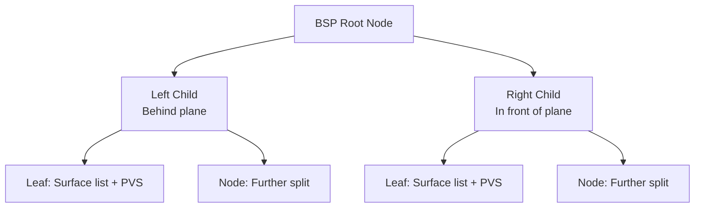
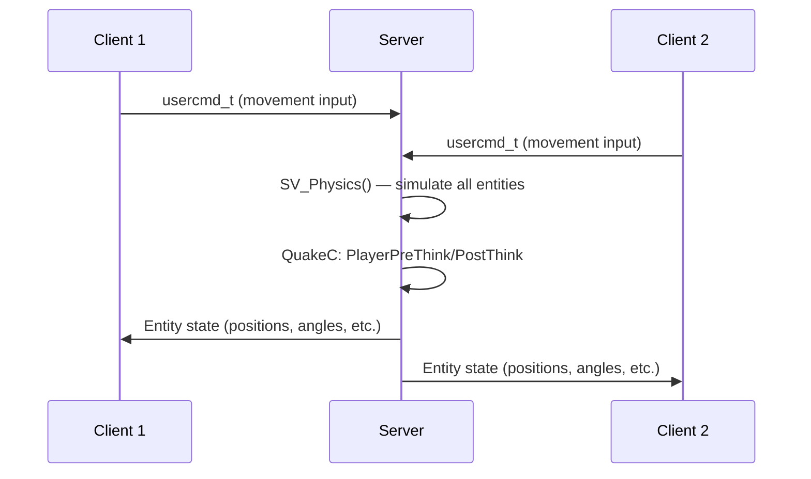
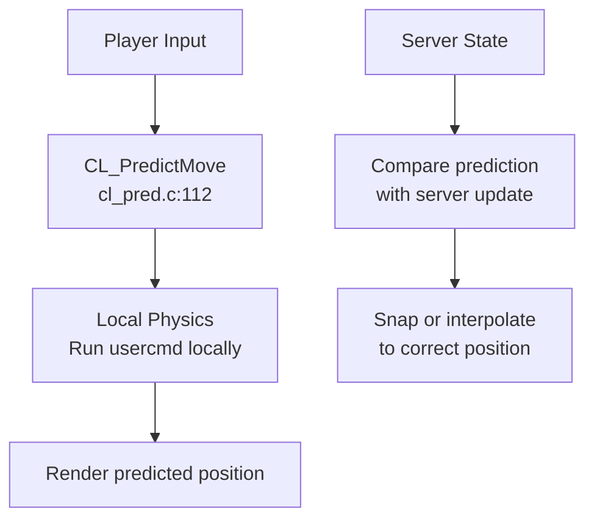
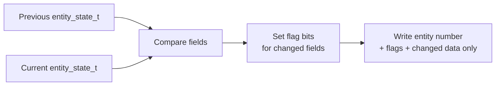
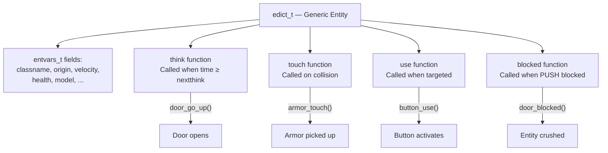
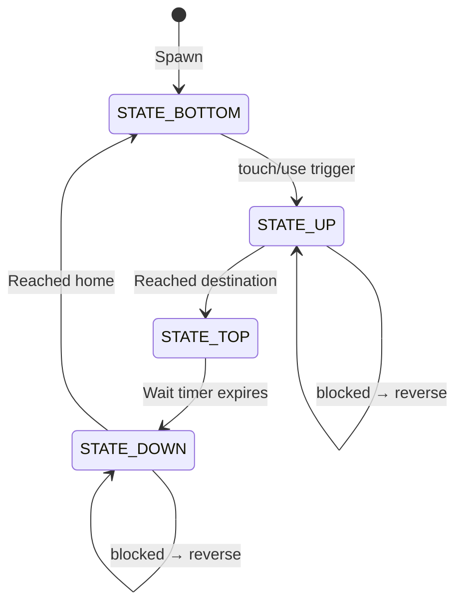
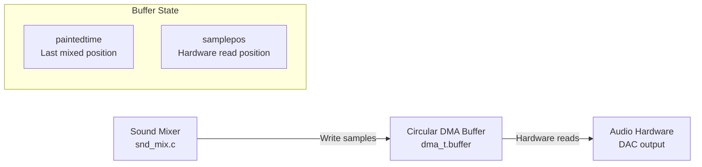

# Design Patterns — Quake Engine

> Reverse-engineered from the id Software Quake source code (1996-1997).
> All file references point to actual source files in this repository.

---

## 1. BSP Tree Rendering Pattern

**Pattern**: Binary Space Partitioning for visibility determination and rendering order.

**Problem**: Rendering a 3D world with correct visibility requires determining which surfaces are visible and in what order to draw them.

**Implementation**:



- The BSP tree is **precomputed** at map compile time and stored in `LUMP_NODES` / `LUMP_LEAFS` of the BSP file
- At runtime, `R_RecursiveWorldNode()` in `Quake/WinQuake/r_bsp.c` traverses the tree front-to-back relative to the camera
- Each leaf contains a **PVS** (Potentially Visible Set) — a compressed bitfield indicating which other leaves are visible from that position
- `R_MarkLeaves()` in `Quake/WinQuake/r_main.c` uses the PVS to skip entire branches that are not visible

**Source files**: `Quake/WinQuake/r_bsp.c`, `Quake/WinQuake/model.c`, `Quake/WinQuake/bspfile.h`

---

## 2. Client-Server Architecture

**Pattern**: Server-authoritative game simulation with clients receiving state updates.

**Problem**: Multiplayer games require a single source of truth for game state while allowing multiple players to interact.

**Implementation**:



- **Server** (`Quake/WinQuake/sv_main.c`, `Quake/WinQuake/sv_phys.c`) runs physics at a fixed tick rate (`sys_ticrate`, default 0.05s = 20Hz)
- **Clients** send `usercmd_t` containing movement input, timestamps, and button presses
- Server processes all commands, runs QuakeC game logic, and broadcasts entity state
- Clients receive updates and interpolate between states for smooth rendering

**Source files**: `Quake/WinQuake/sv_main.c`, `Quake/WinQuake/sv_phys.c`, `Quake/WinQuake/cl_main.c`, `Quake/WinQuake/host.c`

---

## 3. Client-Side Prediction (QuakeWorld)

**Pattern**: Speculative execution of player movement on the client, reconciled with server state.

**Problem**: Network latency causes visible delay between player input and screen response.

**Implementation**:



1. Client runs `CL_PredictUsercmd()` (`Quake/QW/client/cl_pred.c:64`) — applies user input to local physics simulation
2. Predicted position is rendered immediately for responsive feel
3. When server state arrives, client compares predicted vs. actual position
4. Corrections are applied (can cause visible "snapping" on misprediction)
5. Up to 64 frames of history stored (`UPDATE_BACKUP`) for delta replay

**Source files**: `Quake/QW/client/cl_pred.c`, `Quake/QW/client/cl_ents.c`

---

## 4. Delta Compression Pattern (QuakeWorld)

**Pattern**: Differential encoding — only transmit fields that changed since the last acknowledged state.

**Problem**: Sending full entity state for all entities every frame consumes excessive bandwidth.

**Implementation**:



- Server: `SV_WriteDelta()` in `Quake/QW/server/sv_ents.c:155` compares old and new `entity_state_t`
- Sets flag bits (e.g., `U_ORIGIN1`, `U_ANGLE2`, `U_MODEL`) for each changed field
- Writes only the entity number, flags, and changed field data
- Client: `CL_ParseDelta()` in `Quake/QW/client/cl_ents.c:160` decompresses by copying previous state and overwriting flagged fields
- Entity list deltas handled by `SV_EmitPacketEntities()` — adds new entities, updates changed ones, removes deleted ones

**Bandwidth savings**: Typical frame sends ~50-200 bytes instead of ~2000+ bytes for full state.

**Source files**: `Quake/QW/server/sv_ents.c`, `Quake/QW/client/cl_ents.c`, `Quake/QW/client/protocol.h`

---

## 5. Command Pattern (Console System)

**Pattern**: Commands are queued as text strings and executed in sequence.

**Problem**: Multiple subsystems need to trigger actions (key bindings, network, config files, scripts) in a unified way.

**Implementation**:

```
Key press → Key_Event() → keybindings["attack"] → Cbuf_AddText("+attack\n")
Config file → exec config.cfg → Cbuf_InsertText(file_contents)
Network → svc_stufftext → Cbuf_AddText(server_command)
Console → user types "map e1m1" → Cbuf_AddText("map e1m1\n")
    ↓
Cbuf_Execute() — each frame
    ↓
Cmd_ExecuteString("map e1m1")
    ↓
SV_Map_f() — registered handler executes
```

- `Cbuf_AddText()` in `Quake/WinQuake/cmd.c` appends to a text buffer
- `Cbuf_Execute()` processes one line at a time, tokenizing and dispatching
- Commands are registered with `Cmd_AddCommand(name, function)` — stores name → function pointer mapping
- CVars are runtime-configurable via `Cvar_Set()` / `Cvar_RegisterVariable()`

**Source files**: `Quake/WinQuake/cmd.c`, `Quake/WinQuake/cvar.c`, `Quake/WinQuake/keys.c`

---

## 6. Entity-Component Pattern (QuakeC)

**Pattern**: Entities are generic containers with callback-based behavior driven by field assignments.

**Problem**: Game objects (players, doors, items, projectiles) need diverse behavior from a uniform data structure.

**Implementation**:



- All game objects share the `edict_t` structure (`Quake/WinQuake/progs.h`)
- Behavior is determined by assigning callback functions to `think`, `touch`, `use`, `blocked` fields
- The server calls these callbacks based on game events (timer expiry, collision, targeting)
- Entity types are distinguished by `classname` string, not by C type

**Source files**: `Quake/WinQuake/progs.h`, `Quake/WinQuake/pr_edict.c`, `Quake/qw-qc/defs.qc`

---

## 7. Target/Trigger Chain Pattern

**Pattern**: Entities reference each other by name to create activation chains.

**Problem**: Level designers need to create complex sequences (press button → open door → start elevator) without code changes.

**Implementation**:

```mermaid
graph LR
    BTN[Button<br/>target="door1"] -->|SUB_UseTargets| DOOR[Door<br/>targetname="door1"<br/>target="plat1"]
    DOOR -->|SUB_UseTargets| PLAT[Platform<br/>targetname="plat1"]
```

- Entity A sets `self.target = "name"` in the map editor
- Entity B sets `self.targetname = "name"`
- When A fires, `SUB_UseTargets()` (`Quake/qw-qc/subs.qc`) finds all entities with matching `targetname` and calls their `use()` function
- Supports delays (`self.delay`), kill targets (`self.killtarget`), and messages (`self.message`)
- Chains can be arbitrarily deep: Button → Door → Trigger_relay → Platform → ...

**Source files**: `Quake/qw-qc/subs.qc`, `Quake/qw-qc/triggers.qc`, `Quake/qw-qc/doors.qc`, `Quake/qw-qc/buttons.qc`

---

## 8. State Machine Pattern (Movers)

**Pattern**: Doors, platforms, and buttons use simple state machines for their movement lifecycle.

**Problem**: Moving brush entities need predictable open/close behavior with blocking and timing.

**Implementation**:



**States defined in `Quake/qw-qc/doors.qc`:**
- `STATE_TOP = 0` — Fully open
- `STATE_BOTTOM = 1` — Fully closed
- `STATE_UP = 2` — Moving open
- `STATE_DOWN = 3` — Moving closed

**Movement** uses `SUB_CalcMove()` in `Quake/qw-qc/subs.qc` which computes velocity as `(destination - origin) / travel_time` and sets `nextthink` to the arrival time.

**Source files**: `Quake/qw-qc/doors.qc`, `Quake/qw-qc/plats.qc`, `Quake/qw-qc/buttons.qc`, `Quake/qw-qc/subs.qc`

---

## 9. Platform Abstraction Pattern

**Pattern**: Common interface with platform-specific implementations selected at compile time.

**Problem**: The engine must run on DOS, Windows, Linux, and Solaris with different system APIs.

**Implementation**:

```
sys.h          — Defines interface (Sys_FloatTime, Sys_Error, etc.)
  ├── sys_win.c    — Win32 implementation
  ├── sys_linux.c  — Linux implementation
  ├── sys_dos.c    — DOS implementation
  ├── sys_sun.c    — Solaris implementation
  └── sys_null.c   — Stub implementation (porting reference)
```

The same pattern is repeated for:
- **Video**: `vid.h` → `vid_win.c`, `vid_dos.c`, `vid_svgalib.c`, `vid_x.c`, `vid_null.c`
- **Input**: `input.h` → `in_win.c`, `in_dos.c`, `in_sun.c`, `in_null.c`
- **Sound**: `sound.h` → `snd_win.c`, `snd_linux.c`, `snd_dos.c`, `snd_sun.c`, `snd_null.c`
- **CD Audio**: → `cd_win.c`, `cd_linux.c`, `cd_null.c`

Selection is done via Makefile object file lists — only the correct platform file is compiled and linked.

**Source files**: `Quake/WinQuake/sys.h`, `Quake/WinQuake/vid.h`, `Quake/WinQuake/input.h`, `Quake/WinQuake/sound.h`

---

## 10. DMA Circular Buffer Pattern (Sound)

**Pattern**: Hardware reads audio asynchronously from a circular buffer that software fills ahead.

**Problem**: Audio hardware needs continuous samples but the CPU can only generate audio intermittently.

**Implementation**:



- `paintedtime` tracks how far the mixer has written
- `samplepos` tracks where the hardware is currently reading
- Mixer fills `(samplepos + latency) - paintedtime` samples each frame
- 3D spatialization calculates per-channel volume based on listener position relative to sound source (`SND_Spatialize()` in `Quake/WinQuake/snd_dma.c`)

**Source files**: `Quake/WinQuake/snd_dma.c`, `Quake/WinQuake/snd_mix.c`, `Quake/WinQuake/sound.h`

---

## 11. Lazy-Load Caching Pattern (Models)

**Pattern**: Assets are loaded on first access and cached for reuse; cache entries can be evicted under memory pressure.

**Problem**: Loading all game assets at startup would be too slow and memory-intensive.

**Implementation**:

```
Mod_ForName("progs/player.mdl")
    ↓
Search mod_known[] cache (256 entries)
    ↓ (cache miss)
Load from disk: COM_LoadHunkFile()
    ↓
Parse format: Mod_LoadAliasModel() / Mod_LoadBrushModel() / Mod_LoadSpriteModel()
    ↓
Store in hunk memory, add to cache
    ↓ (cache hit on next access)
Return cached pointer
```

- `mod_known[MAX_MOD_KNOWN]` in `Quake/WinQuake/model.c` stores up to 256 loaded models
- Sound samples use `Cache_Alloc()` — can be evicted if memory runs low
- `Mod_ClearAll()` flushes cache on level change

**Source files**: `Quake/WinQuake/model.c`, `Quake/WinQuake/zone.c`

---

## 12. Network Driver Abstraction Pattern

**Pattern**: Pluggable network transport drivers behind a common interface.

**Problem**: Multiple network protocols (UDP, IPX, serial modem, loopback) must be supported transparently.

**Implementation**:

```
net_main.c — Network Manager
  ├── net_loop.c   — Loopback (same machine)
  ├── net_dgrm.c   — Datagram protocol layer
  │   ├── net_udp.c    — BSD UDP sockets
  │   ├── net_wins.c   — Windows Winsock
  │   ├── net_wipx.c   — Windows IPX
  │   ├── net_ipx.c    — DOS IPX
  │   └── net_ser.c    — DOS Serial/modem
  └── net_vcr.c    — VCR recording (debug)
```

- `net_driver_t` function pointers define the interface: `Init`, `Connect`, `CheckNewConnections`, `GetMessage`, `SendMessage`, `Close`
- `net_main.c` iterates over registered drivers to find one that works
- The datagram layer (`net_dgrm.c`) adds reliable messaging (sequence numbers + ACK) on top of raw transport

**Source files**: `Quake/WinQuake/net_main.c`, `Quake/WinQuake/net_dgrm.c`, `Quake/WinQuake/net.h`

---

## Summary of Patterns

| Pattern | Where Used | Key Benefit |
|---------|-----------|-------------|
| BSP Tree Rendering | Rendering | O(n log n) visibility determination |
| Client-Server | Multiplayer | Single authoritative game state |
| Client-Side Prediction | QuakeWorld | Responsive feel despite latency |
| Delta Compression | QuakeWorld | ~90% bandwidth reduction |
| Command Pattern | Console | Unified action dispatch from any source |
| Entity-Component | QuakeC | Flexible game object behavior |
| Target/Trigger Chain | Level Design | Designer-driven event sequences |
| State Machine | Movers | Predictable door/platform behavior |
| Platform Abstraction | System layer | Multi-platform portability |
| DMA Circular Buffer | Sound | Glitch-free audio playback |
| Lazy-Load Cache | Assets | Fast level loads, efficient memory |
| Driver Abstraction | Network | Multiple transport protocol support |
