# External Dependencies — Quake Engine

> Reverse-engineered from the id Software Quake source code (1996-1997).
> All file references point to actual source files in this repository.

---

## 1. Overview

The Quake engine has minimal external dependencies by design. The engine is largely self-contained, implementing its own memory management, math library, and data format parsers. External dependencies are primarily platform SDKs and hardware abstraction libraries.

---

## 2. Windows Dependencies

### 2.1 DirectX SDK

**Location in repo**: `legacy-src/desktop-engine/dxsdk/`, `legacy-src/QW/dxsdk/`

| Component | Header | Library | Used By |
|-----------|--------|---------|---------|
| **DirectDraw** | `ddraw.h` | `ddraw.lib` | `legacy-src/desktop-engine/vid_win.c` — Fullscreen video mode switching, page flipping |
| **DirectInput** | `dinput.h` | `dinput.lib` | `legacy-src/desktop-engine/in_win.c` — Mouse input in exclusive mode |
| **DirectSound** | `dsound.h` | `dsound.lib` | `legacy-src/desktop-engine/snd_win.c` — Primary/secondary sound buffer management |
| **DirectX GUIDs** | — | `dxguid.lib` | GUID definitions for COM interface initialization |

**Version**: DirectX 3–5 era headers (1996-1997)

**Linker references** (`legacy-src/desktop-engine/WinQuake.dsp`):
```
dxguid.lib
```

### 2.2 Scitech MGL (Multi-platform Graphics Library)

**Location in repo**: `legacy-src/desktop-engine/scitech/`, `legacy-src/QW/scitech/`

| Component | Usage |
|-----------|-------|
| **MGL headers** | `legacy-src/desktop-engine/scitech/include/` — Graphics mode enumeration |
| **MGL library** | `mgllt.lib` — Video mode switching, VESA/VBE support |

**Used by**: `legacy-src/desktop-engine/vid_win.c` — Provides video mode enumeration and switching on Windows, especially for VESA-compatible graphics cards.

**Linker references** (`legacy-src/desktop-engine/WinQuake.dsp`):
```
mgllt.lib
```

### 2.3 Windows System Libraries

| Library | Usage | Used By |
|---------|-------|---------|
| `kernel32.lib` | Process, memory, file I/O | `legacy-src/desktop-engine/sys_win.c` |
| `user32.lib` | Window management, input | `legacy-src/desktop-engine/sys_win.c`, `vid_win.c` |
| `gdi32.lib` | DIB (Device Independent Bitmap) rendering | `legacy-src/desktop-engine/vid_win.c` |
| `winmm.lib` | Multimedia timers, joystick, MCI (CD audio) | `legacy-src/desktop-engine/in_win.c`, `cd_win.c` |
| `wsock32.lib` | Winsock 1.1 networking | `legacy-src/desktop-engine/net_wins.c`, `net_wipx.c` |
| `opengl32.lib` | OpenGL 1.1 API | `legacy-src/desktop-engine/gl_vidnt.c` |
| `glu32.lib` | OpenGL Utility Library | `legacy-src/desktop-engine/gl_vidnt.c` |
| `comctl32.lib` | Common controls (UI dialogs) | `legacy-src/desktop-engine/conproc.c` |

---

## 3. Linux Dependencies

### 3.1 System Libraries

| Library | Flag | Usage | Used By |
|---------|------|-------|---------|
| **libc** | — | Standard C library | All source files |
| **libm** | `-lm` | Math functions (sin, cos, sqrt, etc.) | `legacy-src/desktop-engine/mathlib.c` |
| **libX11** | `-lX11` | X Window System | `legacy-src/desktop-engine/vid_x.c`, `in_sun.c` |
| **libXext** | `-lXext` | X11 shared memory extension (XShm) | `legacy-src/desktop-engine/vid_x.c` |
| **libXxf86dga** | `-lXxf86dga` | XFree86 Direct Graphics Access | `legacy-src/desktop-engine/vid_x.c` |
| **libvga** | `-lvga` | SVGAlib direct framebuffer access | `legacy-src/desktop-engine/vid_svgalib.c` |

**Referenced in**: `legacy-src/desktop-engine/Makefile.linuxi386`

### 3.2 OpenGL Libraries (Linux)

| Library | Flag | Usage | Used By |
|---------|------|-------|---------|
| **Mesa3D** | `-lMesaGL` | Software OpenGL implementation | `legacy-src/desktop-engine/gl_vidlinux.c` |
| **GLX** | `-lGL` | X11 OpenGL extension | `legacy-src/desktop-engine/gl_vidlinuxglx.c` |
| **3Dfx GL** | `-l3dfxgl` | 3Dfx Voodoo MiniGL | `legacy-src/desktop-engine/Makefile.linuxi386` |

**Mesa include path**: `-I/usr/local/src/Mesa-3.0/include`
**Referenced in**: `legacy-src/desktop-engine/Makefile.linuxi386`

### 3.3 Linux Sound

| Interface | Device | Usage | Used By |
|-----------|--------|-------|---------|
| **OSS (Open Sound System)** | `/dev/dsp` | Audio output | `legacy-src/desktop-engine/snd_linux.c` |
| **CD-ROM ioctl** | `/dev/cdrom` | CD audio music | `legacy-src/desktop-engine/cd_linux.c` |

> **Note**: No ALSA, PulseAudio, or PipeWire support — these did not exist in 1996-1997.

---

## 4. Solaris Dependencies

| Library | Flag | Usage | Used By |
|---------|------|-------|---------|
| **libm** | `-lm` | Math functions | All |
| **libsocket** | `-lsocket` | BSD socket networking | `legacy-src/desktop-engine/net_udp.c` |
| **libnsl** | `-lnsl` | Name service lookup | Network code |
| **libX11** | `-lX11` | X11 video output | `legacy-src/desktop-engine/vid_sunx.c` |
| **libxil** | `-lxil` | XIL imaging library (Sun accelerated) | `legacy-src/desktop-engine/vid_sunxil.c` |

**Referenced in**: `legacy-src/desktop-engine/Makefile.Solaris`, `legacy-src/QW/Makefile.Solaris`

---

## 5. DOS Dependencies

| Dependency | Usage | Used By |
|------------|-------|---------|
| **CWSDPMI** | DOS Protected Mode Interface (DPMI host) | `legacy-src/desktop-engine/cwsdpmi.exe` |
| **DJGPP** | GCC cross-compiler for DOS | Build toolchain (not in repo) |
| **VGA hardware** | Direct register access for video | `legacy-src/desktop-engine/vid_vga.c`, `vid_dos.c` |
| **DMA controller** | Direct Memory Access for sound | `legacy-src/desktop-engine/snd_dos.c` |
| **Gravis UltraSound SDK** | GUS-specific sound card support | `legacy-src/desktop-engine/snd_gus.c` |
| **IPX TSR** | Novell IPX protocol stack | `legacy-src/desktop-engine/net_ipx.c` |
| **COM ports** | Serial modem I/O | `legacy-src/desktop-engine/net_comx.c`, `net_ser.c` |

---

## 6. 3Dfx / Voodoo Dependencies

| Dependency | Usage | Source |
|------------|-------|--------|
| **3Dfx MiniGL** | OpenGL subset for Voodoo cards | `legacy-src/desktop-engine/3dfx.txt` |
| **3dfxgl shared library** | Linux 3Dfx OpenGL | `legacy-src/QW/glqwcl.3dfxgl` |

**Build target**: `glquake.3dfxgl` in `legacy-src/desktop-engine/Makefile.linuxi386`

---

## 7. Build-Time Dependencies

| Tool | Platform | Purpose |
|------|----------|---------|
| **GCC 2.x** | Linux/Solaris | C compiler |
| **GNU Make** | Linux/Solaris | Build automation |
| **GNU as** | Linux | x86 assembler |
| **MSVC 4.x/5.x** | Windows | C compiler, linker, resource compiler |
| **MASM** | Windows | x86 assembler |
| **gas2masm** | Windows | AT&T → MASM assembly converter (`legacy-src/QW/gas2masm/gas2masm.c`) |
| **QuakeC compiler (qcc)** | Any | Compiles `.qc` → `progs.dat` (not included in repo) |

---

## 8. Runtime Dependencies

| Dependency | Platform | Required For |
|------------|----------|-------------|
| **Game data files** (`pak0.pak`, `pak1.pak`) | All | Textures, models, sounds, maps |
| **OpenGL ICD** | Windows/Linux | Hardware-accelerated rendering |
| **SVGAlib** | Linux | Console-mode rendering |
| **X Server** | Linux/Solaris | Windowed rendering |
| **Sound device** (`/dev/dsp`) | Linux | Audio output |
| **CD-ROM drive** | All | Music playback (optional) |

---

## 9. Dependency Diagram

```mermaid
graph TD
    subgraph "Quake Engine"
        ENGINE[Engine Core<br/>C + x86 ASM]
        QC[QuakeC VM]
        SW[Software Renderer]
        GLREN[OpenGL Renderer]
    end

    subgraph "Windows SDKs"
        DX[DirectX SDK<br/>DirectDraw, DirectInput,<br/>DirectSound]
        MGL[Scitech MGL<br/>Video modes]
        WIN32[Win32 API<br/>kernel32, user32, gdi32]
        WSOCK[Winsock 1.1]
        OGL_W[opengl32.dll]
    end

    subgraph "Linux Libraries"
        X11[X11 / Xlib]
        SVGA[SVGAlib]
        MESA[Mesa3D / GLX]
        OSS[OSS /dev/dsp]
        POSIX[POSIX / libc]
    end

    subgraph "DOS"
        DPMI[CWSDPMI]
        VGA[VGA Registers]
        DMA[DMA Controller]
    end

    subgraph "Hardware"
        VOODOO[3Dfx Voodoo<br/>MiniGL]
        GUS[Gravis UltraSound]
    end

    ENGINE --> WIN32
    ENGINE --> POSIX
    ENGINE --> DPMI
    SW --> DX
    SW --> MGL
    SW --> SVGA
    SW --> X11
    SW --> VGA
    GLREN --> OGL_W
    GLREN --> MESA
    GLREN --> VOODOO
    ENGINE --> WSOCK
    ENGINE --> OSS
    ENGINE --> DMA
    ENGINE --> GUS
```



---

## 10. Notable Absences

The following common dependencies are **not used** in the codebase:

| Dependency | Reason |
|------------|--------|
| **SDL** | Did not exist in 1996 (SDL 1.0 released 1998) |
| **ALSA / PulseAudio / PipeWire** | Did not exist; OSS was the standard |
| **Wayland** | Did not exist; X11 was the only option |
| **Vulkan** | Did not exist (Vulkan 1.0 released 2016) |
| **OpenAL** | Did not exist; custom mixing was the norm |
| **zlib** | Not used; custom PAK archive format |
| **libpng / libjpeg** | Not used; custom WAD/LMP texture formats |
| **Any C++ STL** | Pure C codebase |
| **Any unit test framework** | No testing infrastructure exists |
